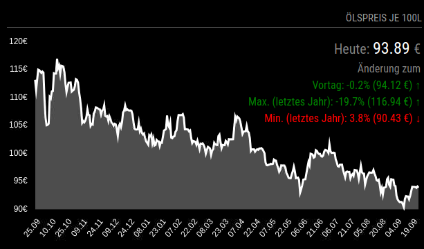

# MMM-Oelpreise
Chart module for [MagicMirror²](https://github.com/MichMich/MagicMirror). The module displays oil prices for the last 12 months based on [Chart.js](http://www.chartjs.org/) and the API of [heizoel24.de](https://www.heizoel24.de/charts/heizoel).


Thanks to @eckonator for his work, the rest was added by AI due to lack of knowledge. ;)
An attempt was made to add the following changes:
- Period of observation changed to the past 12 months
- Configurable overlay for current and past values, minimum and maximum values for the past 12 months
- minor customisation of the chart (line thickness, dot symbols)


## Screenshot


## Installation

In your terminal, go to your MagicMirror's Module folder:
````
cd ~/MagicMirror/modules
````

Clone this repository:
````
git clone https://github.com/surger13/MMM-Oelpreise.git
````

Install dependencies:
````
cd ~/MagicMirror/modules/MMM-Oelpreise
````

````
npm install
````

Configure the module in your `config.js` file.

## Using the module

To use this module, add it to the modules array in the `config/config.js` file:
````javascript
modules: [
    {
        module: 'MMM-Oelpreise',
        position: 'bottom_right',
        header: 'Ölpreis je 100l',
        config: {
            amount         : '3000',  // amount in liter
            updateInterval : 86400, // 1 day in seconds
            width          : 600,   // width in pixel
            height         : 400,    // height in pixel
            showOverlay: true, // Zeigt das Overlay an, wenn true
            overlayBlink: false, // Overlay temporär ausblenden um Graph vollständig zu sehen?
            overlayUnvisibleDuration: 5000, // Dauer, für die das Overlay ausgeblendet wird (in ms)
            overlayInterval: 13000, // Dauer wie lang das Overlay angezeigt wird (in ms)
            fadeDuration: 500, // Dauer des Fade-In/Out-Effekts (in ms)
            showPreviousDay: true,  // Anzeige Preisvergleich zum Vortag
            showLastMonth: false,     // Anzeige Preisvergleich zum Vormonat
            showLastYear: false,      // Anzeige Preisvergleich zum Vorjahr
            showMaxMin: true,         // Vergleich mit den Max- und Minpreise der letzten 12 Monate	
        }
    }
]
````

## Configuration options

The following property can be configured:

| Option         | Description                | Default value |
|----------------|----------------------------|:-------------:|
| amount         | Amount in liter            |  ```3000```   |
| updateInterval | Update Interval in seconds |  ```86400```  |
| width          | Chart width in px.         |  ```1200```   |
| height         | Chart height in px.        |   ```800```   |
|                |                            |               |
| see config.js  | see config.js              |               |


